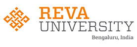

# REVA University, School of Computer Science and Engineering
## Center of Excellence For Research in Cognitive Technologies and Cyber Security
The Center houses two research labs funded by **Department of Science and Technology (DST), Government of India**. 

1. The DST-ICPS 2018 Funded Lab for Cancer Classification using Gene Expression Data
Investigators for this project are Prof. Nimrita Koul and Dr. Sunilkumar S Manvi. Ms. Aruna A S is the research fellow working with us for this project.

Equipment in the Lab-
2 Workstations - Intel Core i7-10700, 16 GB RAM, 4.8GhZ with NVIDIA GeForce RTX 4000, 8GB GPU, WIndows 10 Professional
7 Desktop Machines- Intel Core i7-10700, 4.8GhZ. 8GB RAM
Total:  9 Machines

2. The DST-TIASN 2020 Funded Lab for Blockchain Enabled Organ Donation and Transplant System
Investigators for this project are Prof. Nimrita Koul and Dr. Sunilkumar S Manvi. Mr. Navjeeva Chauhan, Mr. Vikramaditya, and Ms. Likitha are the interns working with us on this project.

Equipment - 
3 Workstations - Intel Core i7-10700, 32 GB RAM, 4.8GhZ with NVIDIA GeForce RTX 3070, 8GB GPU, WIndows 10 Professional
12 Desktop Machines - Intel Core i7-10700, 4.8GhZ. 16GB RAM
Total : 15 Machines

### Contact
For collaborative research work please write to us at ssmanvi@reva.edu.in or nimrita.koul@reva.edu.in.
